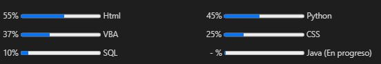

#
#
# Hello, I'm Daniel González.

#

<h4>I'm from Colombia.</h4>
 
<h4>I'm an IT Profressional. </h4>
 

<h4> I'm studyng Software Developing. </h4>
 

<h4>  I like listening to music, learning about English, new technologies and traveling to new places. </h4>
 

# Skills  

<!-- 
<h4> -->

#

 
 

  